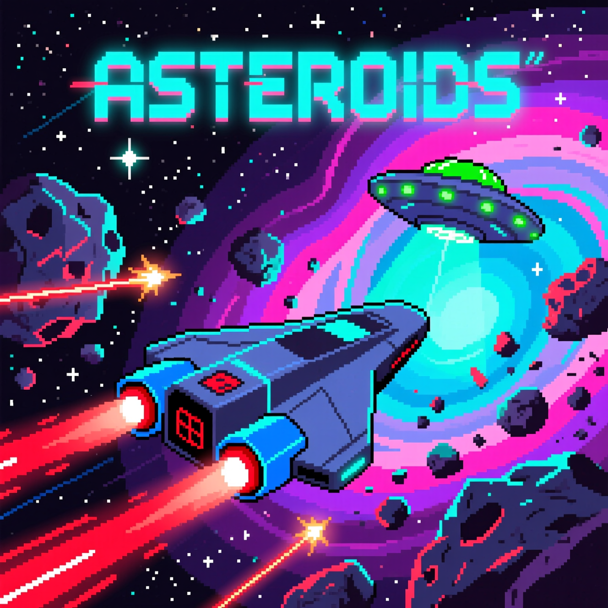

# 🚀 Asteroids — космический шутер в стиле ретро

> Управляй кораблём, уничтожай астероиды и НЛО, набирай очки — и не дай себя уничтожить!

 

---

## 🎮 Как играть

- **Левая кнопка мыши** → выстрел (стоит **5 очков**)
- **Правая кнопка мыши** → "толчок" корабля (для движения — спамь!)
- Корабль **автоматически поворачивается в сторону курсора**

---

## 💥 Механика

### Астероиды
- Летят по прямой
- При попадании разбиваются на **2 меньших**
- Всего **4 размера**:
  - Самый большой — **+10 очков**
  - Второй — **+20**
  - Третий — **+30**
  - Самый маленький — **+40** (исчезает)

### НЛО
- Преследует игрока
- Уничтожается **одним выстрелом**
- Даёт **+50 очков**

### Особенности
> Если НЛО врезается в астероид — ты получаешь **очки за оба объекта**!  
> Используй это, чтобы уклоняться от камней и максимизировать счёт.

---

## 📦 Скачать игру

👉 [Скачать последнюю версию (Windows + Linux)](https://github.com/Zubasty/Asteroids/releases)

### 🐧 Linux
```bash
tar -xzvf Asteroids-Linux-x64.tar.gz
chmod +x Asteroids.x86_64
./Asteroids.x86_64
